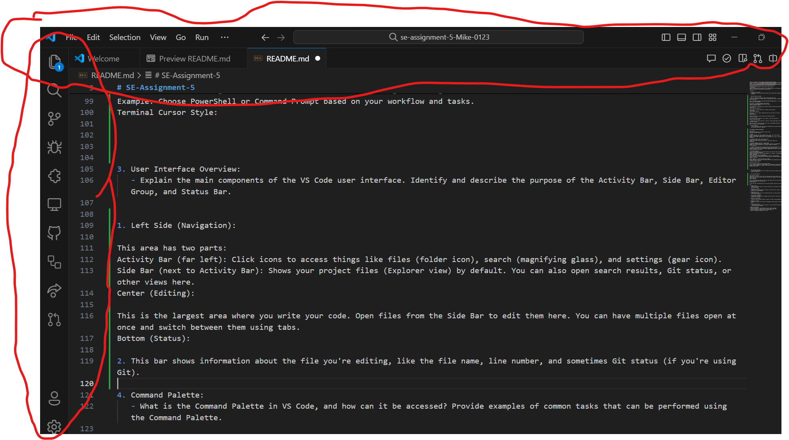
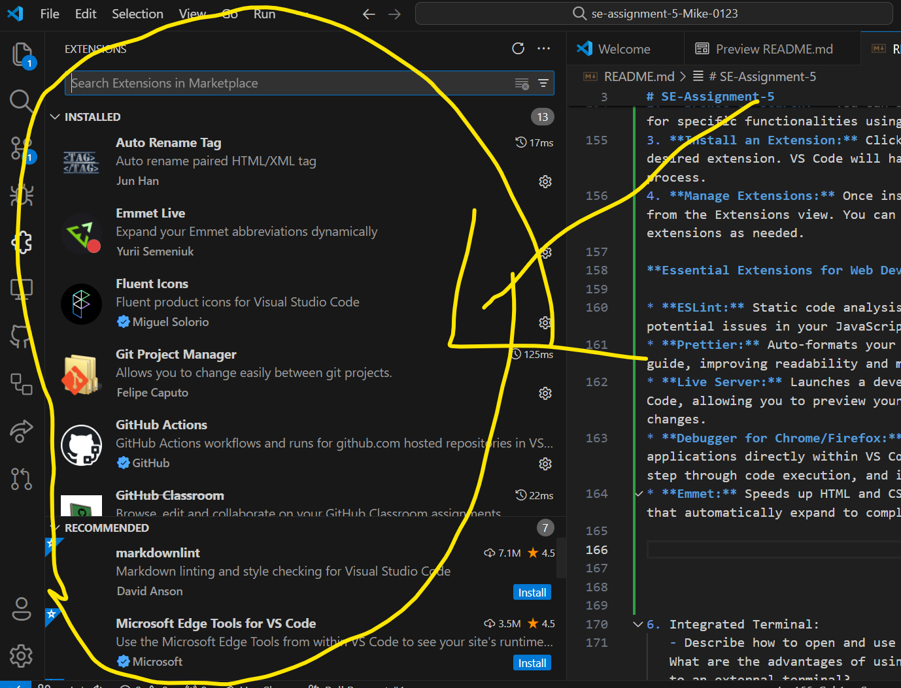
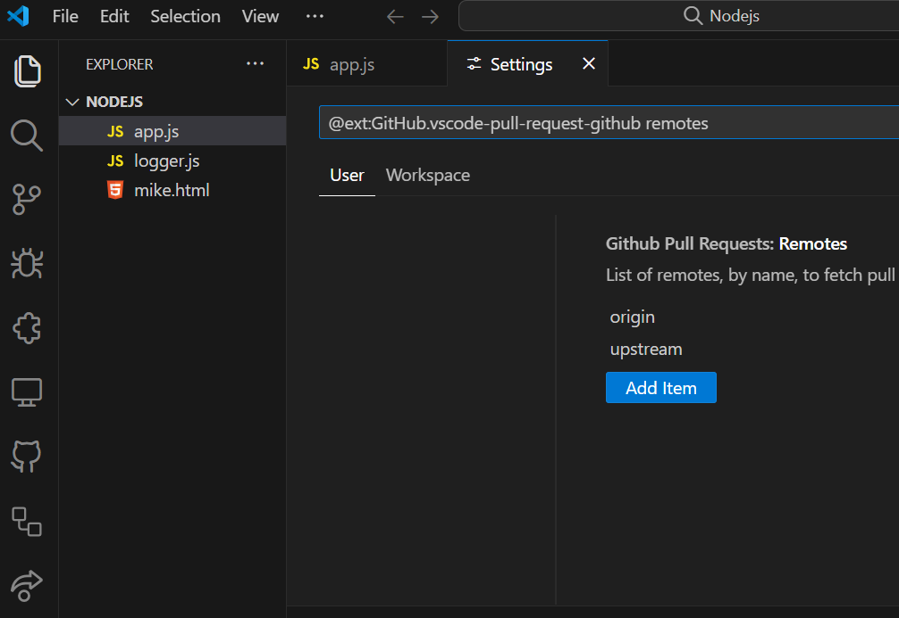
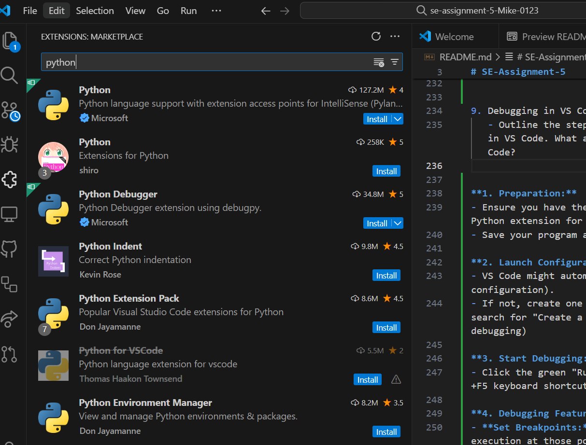

# SE-Assignment-5
Installation and Navigation of Visual Studio Code (VS Code)
 Instructions:
Answer the following questions based on your understanding of the installation and navigation of Visual Studio Code (VS Code). Provide detailed explanations and examples where appropriate.

 Questions:

1. Installation of VS Code:
   - Describe the steps to download and install Visual Studio Code on Windows 11 operating system. Include any prerequisites that might be needed.

  **STEPS TO INSTALL VS STUDIO**

1. Open your web browser and go to https://code.visualstudio.com/.
Click on the "Download for Windows" button to download the installer (VSCodeSetup-x64-<version>.exe).
Run the Installer:

Once the download completes, locate the downloaded VSCodeSetup-x64-<version>.exe file and double-click it to start the installation.
Accept the License Agreement:

Click "Next" to proceed through the setup wizard.
Accept the license agreement terms and click "Next".
Select Destination Location:

Leave the default installation path or choose a different location where you want to install VS Code.
Click "Next".
Create Start Menu Shortcuts:

Choose whether to create shortcuts for VS Code in the Start Menu.
Click "Next".
Create Desktop Shortcut:

Optionally, select to create a desktop shortcut for quick access to VS Code.
Click "Next".
Install VS Code:

Click on the "Install" button to begin the installation process.
Finish Installation:

Once the installation completes, click "Finish" to exit the setup wizard.
Launch Visual Studio Code:

2. Double-click the desktop shortcut or search for "Visual Studio Code" in the Start menu to launch the application.
Setup and Customize:

Upon first launch, VS Code may prompt you to install recommended extensions or configure settings. Follow the prompts to set up the editor according to your preferences.

2. First-time Setup:
   - After installing VS Code, what initial configurations and settings should be adjusted for an optimal coding environment? Mention any important settings or extensions.

THE IMPORTANT SETTING AND EXTENSION

Open VS Code.
Go to File > Preferences > Settings (or press Ctrl+,).
Important Settings to Adjust:

1. Theme:
Choose a theme that suits your preference (e.g., light, dark, high contrast).
Navigate to "Workbench > Color Theme" in the settings.
Example: Select "Dark+ (default dark)" for a dark theme that's easy on the eyes during long coding sessions.
Font Size:

2. Adjust the editor's font size to your liking.
Go to "Editor > Font Size" in the settings.
Example: Set "Editor: Font Size" to 14 for a comfortable reading size.
Keybindings:

3. Customize keyboard shortcuts for common tasks.
Navigate to "Keyboard Shortcuts" in the settings to modify or add keybindings.
Example: Add a custom keybinding for a specific command or extension.
File Associations:

4. Configure file associations to open specific file types with preferred applications or extensions.
Use "Files: Associations" in the settings to manage file associations.
Example: Associate .html files with the HTML language mode for syntax highlighting and IntelliSense support.
Installing Essential Extensions:

5. Accessing Extensions:
Click on the Extensions icon in the Activity Bar on the side (or press Ctrl+Shift+X).
Finding and Installing Extensions:
Search for extensions by name or browse categories like "Popular", "Recommended", or "Programming Languages".
Example Extensions:
ESLint: JavaScript linter for code quality.
Live Server: Launch a local development server with live reload capability.
GitLens: Enhances Git integration with advanced features like blame annotations and repository insights.
Managing Extensions:

Enable, disable, or uninstall extensions as needed.
Ensure extensions are up to date for optimal performance and compatibility with VS Code updates.
Integrated Terminal Settings:

Configuring Default Shell:

Set your preferred shell for the integrated terminal.
Go to "Terminal > Integrated > Shell: Windows" in the settings to change the default shell.
Example: Choose PowerShell or Command Prompt based on your workflow and tasks.
Terminal Cursor Style:

3. User Interface Overview:
   - Explain the main components of the VS Code user interface. Identify and describe the purpose of the Activity Bar, Side Bar, Editor Group, and Status Bar.

1. **Left Side (Navigation):**
This area has two parts:
Activity Bar (far left): Click icons to access things like files (folder icon), search (magnifying glass), and settings (gear icon).
Side Bar (next to Activity Bar): Shows your project files (Explorer view) by default. You can also open search results, Git status, or other views here.
Center (Editing):

This is the largest area where you write your code. Open files from the Side Bar to edit them here. You can have multiple files open at once and switch between them using tabs.
Bottom (Status):

2. This bar shows information about the file you're editing, like the file name, line number, and sometimes Git status (if you're using Git).

4. Command Palette:
   - What is the Command Palette in VS Code, and how can it be accessed? Provide examples of common tasks that can be performed using the Command Palette.

**1. Open a Specific File:**
1. Press `Ctrl+Shift+P` (Windows/Linux) or `Cmd+Shift+P` (Mac) to open the Command Palette.
2. Start typing the name of the file you want to open. As you type, VS Code will suggest matching files based on what you've entered.
3. Once the desired file appears in the list, select it with your arrow keys and press Enter to open it.

**2. Find and Replace Text:**
1. Open the Command Palette as described above.
2. Type "Replace All" and press Enter.
3. In the two input fields that appear, enter the text you want to find (in the "Find" field) and the text you want to replace it with (in the "Replace" field).
4. Click the "Replace All" button to replace all occurrences of the search term with the replacement text, or click "Replace" to review each match and replace individually.

**3. Initialize a Git Repository:**
1. Open the Command Palette.
2. Type "Git: Initialize Repository" and press Enter.
3. VS Code will prompt you to choose the location for your Git repository (usually the root directory of your project). Select the desired location and confirm.

5. Extensions in VS Code:
   - Discuss the role of extensions in VS Code. How can users find, install, and manage extensions? Provide examples of essential extensions for web development.

   
**Finding, Installing, and Managing Extensions:**
1. **Open the Extensions view:** Click on the Extensions icon (puzzle piece icon) in the Activity Bar on the left side of VS Code.
2. **Browse or Search:** You can browse popular extensions or search for specific functionalities using the search bar.
3. **Install an Extension:** Click the "Install" button next to the desired extension. VS Code will handle the download and installation process.
4. **Manage Extensions:** Once installed, you can manage extensions from the Extensions view. You can disable, enable, or uninstall extensions as needed.

**Essential Extensions for Web Development (Examples):**
* **ESLint:** Static code analysis tool to identify and fix errors and potential issues in your JavaScript code.
* **Prettier:** Auto-formats your code according to a consistent style guide, improving readability and maintainability.
* **Live Server:** Launches a development server directly within VS Code, allowing you to preview your web pages in real-time as you make changes.
* **Debugger for Chrome/Firefox:** Enables debugging your web applications directly within VS Code, allowing you to set breakpoints, step through code execution, and inspect variables.
* **Emmet:** Speeds up HTML and CSS coding by providing abbreviations that automatically expand to complete code snippets.

6. Integrated Terminal:
   - Describe how to open and use the integrated terminal in VS Code. What are the advantages of using the integrated terminal compared to an external terminal?

   **1. User Interface:**
- Think of VS Code as having three main areas:
   - Left side (navigation): Find files, search code, use Git.
   - Center (editing): Write and edit your code.
   - Bottom (status): See info about the file you're editing.

**2. Command Palette (Search Bar):**
- Stuck? Press `Ctrl+Shift+P` (Windows/Linux) or `Cmd+Shift+P` (Mac) to find any VS Code feature or setting quickly. Just type what you need and select it!

**3. Extensions (Add-ons):**
- VS Code extensions are like cool tools you can add to make coding easier. There are extensions for specific languages (like JavaScript), improving code formatting, or even launching a web server right inside VS Code! Find them in the Extensions view (puzzle piece icon on the left).

**4. Integrated Terminal:**
- Want to run commands from within VS Code? No problem! Press `Ctrl+` (backtick) on Windows/Linux or `Cmd+` (backtick) on Mac to open a terminal window right there in VS Code. It's like having two windows in one, making coding smoother!

7. File and Folder Management:
   - Explain how to create, open, and manage files and folders in VS Code. How can users navigate between different files and directories efficiently?

**Creating Files and Folders:**
1. **Right-click:** In the Explorer view (left side of VS Code), right-click on an existing folder where you want to create a new file or folder.
2. **Select "New File" or "New Folder."**
3. **Type a name:** Enter the desired name for your file or folder and press Enter.

**Opening Files:**
1. **Double-click:** In the Explorer view, double-click on a file to open it for editing in the main editor area.
**Navigating Efficiently:**
* **Explorer View:** Browse your project's file structure visually. Expand and collapse folders to find what you need.
* **Search Bar:** Type the name of a file or folder to quickly locate it within your project.
* **Open Recent:** Click the "File" menu (top left) and go to "Open Recent" to access recently opened files.
* **Keyboard Shortcuts:** Use shortcuts like `Ctrl+T` (Windows/Linux) or `Cmd+T` (Mac) to open a new file and `Ctrl+P` (Windows/Linux) or `Cmd+P` (Mac) to open a specific file.

**Shortcuts for Faster Access (Bonus!):**

While VS Code doesn't have built-in bookmarking like a web browser, you can create shortcuts for frequently used files or folders:

1. **Open the file or folder.**
2. **Pin to Favorites:** Right-click on the file/folder tab in the editor area and select "Pin to Favorites." This keeps the tab open even when you close other files.

8. Settings and Preferences:
   - Where can users find and customize settings in VS Code? Provide examples of how to change the theme, font size, and keybindings.

   **Finding the Settings:**
1. Open the Command Palette with `Ctrl+Shift+P` (Windows/Linux) or `Cmd+Shift+P` (Mac).
2. Type "Preferences: Open Settings" and press Enter.

**Changing the Theme:**
1. In the Settings editor, search for "Theme" or navigate to the "Appearance" section.
2. You'll see a list of built-in themes like "Dark+ Default" or "Light+ Default." Select the theme you prefer.
3. VS Code also supports installing additional themes from the Extensions view (puzzle piece icon on the left side).

**Adjusting Font Size:**
1. Search for "Font Size" in the Settings editor or navigate to the "Font" section.
2. Use the slider or enter a specific value to adjust the font size for your code editor.

**Customizing Keybindings:**
1. Search for "Keyboard Shortcuts" in the Settings editor or navigate to the "Keyboard Shortcuts" section.
2. You can view existing keybindings or search for a specific command to see its current keyboard shortcut.
3. Click on the keybinding you want to change and press the new key combination you prefer (e.g., `Ctrl+Shift+B` for bold text formatting).
4. Alternatively, you can download and install custom keybinding sets (often available as extensions) that cater to specific programming languages or workflows.

9. Debugging in VS Code:
   - Outline the steps to set up and start debugging a simple program in VS Code. What are some key debugging features available in VS Code?

   
**1. Preparation:**
- Ensure you have the appropriate language extension installed (e.g., Python extension for Python scripts).
- Save your program as a file.

**2. Launch Configuration (Optional):**
- VS Code might automatically create a `launch.json` file (debugging configuration).
- If not, create one using the Command Palette (Ctrl+Shift+P) and search for "Create a launch.json file." (Skip this step for very basic debugging)

**3. Start Debugging:**
- Click the green "Run and Debug" button in the top bar. (Or use F5/Fn+F5 keyboard shortcut)

**4. Debugging Features:**
- **Set Breakpoints:** Click on line numbers in the code to pause execution at those points.
- **Step Through Code:** Use "Step Over" (F10) and "Step Into" (F11) buttons to execute code line by line.
- **Inspect Variables:** The "Variables" pane (usually on the right side) shows variable values. (May appear automatically)
- **Console Output:** The integrated terminal displays debugging messages and program output.

10. Using Source Control:
    - How can users integrate Git with VS Code for version control? Describe the process of initializing a repository, making commits, and pushing changes to GitHub.

**1. Initializing a Git Repository:**
- Open your project folder in VS Code.
- Click on the Source Control icon (gear icon) in the Activity Bar on the left side.
- If no Git repository exists, you'll see the option to "Initialize Repository." Click on it.
- This creates a `.git` folder in your project directory, marking it as a Git repository.

**2. Making Commits:**
- Edit your code files as usual.
- Changes will be reflected in the Source Control view under the "Changes" tab.
- Stage the changes you want to include in your next commit. You can:
    - Stage individual lines: Right-click on a line and select "Stage Line."
    - Stage entire files: Click the checkbox next to a file in the Changes tab.
- Type a descriptive commit message in the commit message box at the bottom.
- Click the blue "Commit" button to create a snapshot of your changes with the message.

**3. Pushing Changes to GitHub (Remote Repository):**
- Make sure you have a GitHub account and a remote repository set up for your project.
- In the Source Control view, click on the "..." button next to the branch name (usually "main").
- Select "Publish to GitHub" from the menu.
- If it's your first time connecting, VS Code will guide you through the authentication process.
- Choose the remote repository you want to push your changes to.
- Click the green "Push" button to send your local commits to the remote repository on GitHub.

 Submission Guidelines:
- Your answers should be well-structured, concise, and to the point.
- Provide screenshots or step-by-step instructions where applicable.
- Cite any references or sources you use in your answers.
- Submit your completed assignment by 1st July 

